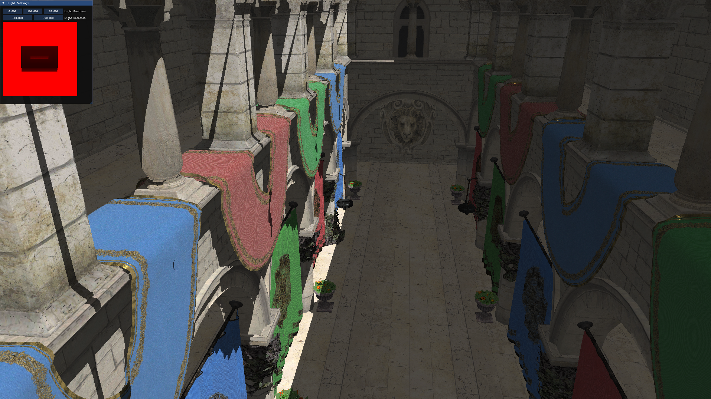

[](https://github.com/XanderBert/EOS/actions/workflows/cmake-multi-platform.yml)

# EOS
Eos the goddess of dawn, aka the first light of the day. A wordplay on lighting.

> [!WARNING] 
> This project is still in its early stages.

Eos aims to be:

- Bindless Rendering Framework. Mainly targetting Vulkan.
- As GPU-friendly as possible, while providing a "higher" level API for ease of use.
- only targets Windows and Linux.

# Dependencies
> [!NOTE] 
> Dependencies are fetched automatically during CMake configure using `FetchContent` in `cmake/deps.cmake`.
> Versions are centralized in `cmake/deps-lock.cmake`.

### Core EOS dependencies
- [GLFW](https://github.com/glfw/glfw) (`3.4`)
- [Volk](https://github.com/zeux/volk) (`master`, or Vulkan SDK-matched tag when available)
- [Vulkan Utility Libraries](https://github.com/KhronosGroup/Vulkan-Utility-Libraries) (`main`, or Vulkan SDK-matched tag when available)
- [Vulkan Memory Allocator (VMA)](https://github.com/GPUOpen-LibrariesAndSDKs/VulkanMemoryAllocator) (`v3.2.1`)
- [spdlog](https://github.com/gabime/spdlog) (`v1.15.2`)
- [stb](https://github.com/nothings/stb) (`master`)
- [KTX-Software](https://github.com/KhronosGroup/KTX-Software) (`v4.4.2`)
- [Slang](https://github.com/shader-slang/slang) binaries (`2026.4`, downloaded from GitHub releases)

### Optional EOS dependencies
- [Dear ImGui](https://github.com/ocornut/imgui) (`v1.92.6`) when `EOS_USE_IMGUI=ON` (default)
- [Tracy](https://github.com/wolfpld/tracy) (`v0.10`) when `EOS_USE_TRACY=ON`

### Example-only dependencies
- [Assimp](https://github.com/assimp/assimp) (`v6.0.4`)
- [GLM](https://github.com/g-truc/glm) (`1.0.1`)

### System dependencies
- Vulkan SDK (required)


# Building
This project is built using CMake and Ninja.


## **Prerequisites:**
1.  **CMake:** Ensure CMake is installed and accessible from your command line/terminal. ([Download CMake](https://cmake.org/download/))
2.  **Ninja:** Ensure Ninja is installed and accessible. ([Download Ninja](https://github.com/ninja-build/ninja/releases))
3.  **C++ Compiler:**
    * **Linux:** A C++ compiler like GCC or Clang. (e.g., `sudo apt update && sudo apt install build-essential g++` on Debian/Ubuntu).
    * **Windows:** Microsoft Visual C++ (MSVC), usually installed with Visual Studio. Make sure the "Desktop development with C++" workload is installed.
4.  **Vulkan SDK:** Install the Vulkan SDK for your platform. ([Download Vulkan SDK](https://vulkan.lunarg.com/sdk/home))


## **Build Steps:**

1.  **Clone the repository:**
    ```bash
    git clone https://github.com/XanderBert/EOS.git
    cd EOS
    ```

2.  **Run the appropriate build script:**
    * Linux: `build.sh` script in the root directory of the project.
    * Windows: `build.bat` script in the root directory of the project.


# Screenshots



# Inspiration
This project is heavily inspired by LVK and The Forge
