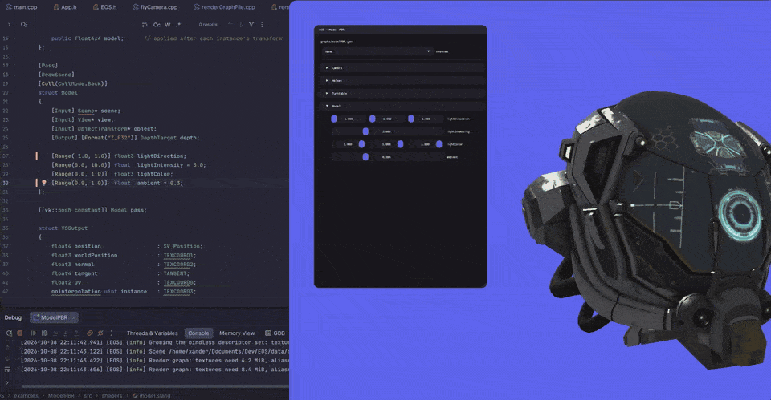

[](https://github.com/XanderBert/EOS/actions/workflows/cmake-multi-platform.yml)

# EOS
Eos the goddess of dawn, aka the first light of the day. A wordplay on lighting.

> [!WARNING] 
> This project is still in its early stages.

Eos aims to be:

- Bindless Rendering Framework. Mainly targetting Vulkan.
- As GPU-friendly as possible, while providing a "higher" level API for ease of use.
- only targets Windows and Linux.

# Dependencies
> [!NOTE] 
> Dependencies are fetched automatically during CMake configure using `FetchContent` in `cmake/deps.cmake`.
> Versions are centralized in `cmake/deps-lock.cmake`.

### Core EOS dependencies
- [GLFW](https://github.com/glfw/glfw)
- [Volk](https://github.com/zeux/volk)
- [Vulkan Utility Libraries](https://github.com/KhronosGroup/Vulkan-Utility-Libraries)
- [Vulkan Memory Allocator (VMA)](https://github.com/GPUOpen-LibrariesAndSDKs/VulkanMemoryAllocator)
- [spdlog](https://github.com/gabime/spdlog)
- [KTX-Software](https://github.com/KhronosGroup/KTX-Software)
- [GLM](https://github.com/g-truc/glm) 
- [rapidyaml](https://github.com/biojppm/rapidyaml)
- [fastGLTF](https://github.com/spnda/fastgltf)
### Optional EOS dependencies
- [Slang](https://github.com/shader-slang/slang) when `EOS_SHADER_TOOLS=ON`
- [stb](https://github.com/nothings/stb) when `EOS_BUILD_TEXTURE_TOOLS=ON`
- [Dear ImGui](https://github.com/ocornut/imgui) when `EOS_USE_IMGUI=ON`
- [Tracy](https://github.com/wolfpld/tracy) when `EOS_USE_TRACY=ON`

### System dependencies
- Vulkan SDK (required)


# CMake Options
All build toggles are exposed as CMake options and can be configured with `-D...` flags.

```cmake
option(EOS_VULKAN "Enable Vulkan backend" ON)
option(EOS_USE_IMGUI "Enable ImGui integration" ON)
option(EOS_USE_TRACY "Enable Tracy profiler" ON)
option(EOS_BUILD_EXAMPLES "Build example applications" ON)
option(EOS_SHADER_TOOLS "Enable shader tools (hot reload, shader compiler, prebuild shader compile step)" ON)
option(EOS_BUILD_TEXTURE_TOOLS "Build the texture compressor tool" ON)
```

### Shader path cache variables

- `EOS_PROJECT_SHADER_PATH`:
    - Empty by default.
- `EOS_SHADER_OUTPUT_PATH`:
    - Defaults to `bin` in the repository root.
    - Used as the output location for compiled shaders.


# Shaders
Shaders are written in [Slang](https://shader-slang.org). Every `.slang` file with `[shader("...")]` entry points is a
program; the other files are modules it imports.

- **Compilation**: before an example builds, `EOSShaderCompilerTool` compiles its programs and the engine's into
  `bin/shaders/<Example>/<Debug|Release>/<module>.EOS`. Each file holds the SPIR-V of every entry point plus the
  reflection (push-constant size, thread-group size, specialization constants, vertex inputs, color outputs, bindings).
  A program is only recompiled when one of its source files (imports included), the compiler options or the Slang
  version changed. `--force` recompiles everything, `--reflect <module>` prints a program's reflection and
  `--dump-spirv <dir>` writes its SPIR-V. A build where no shader changed does not start Slang.
- **Precompiled library**: before EOS builds, the engine's modules (`src/shaders/eos/`) are precompiled to Slang IR
  in `bin/shaders/EOS/<Debug|Release>/modules/`. Every compile, at build time and at runtime, loads those instead of
  parsing and type-checking the library again, which makes recompiling a program that uses the material and BSDF
  code about three times faster (hot reload, shader graph edits). A module whose sources changed is compiled from
  source until the next build precompiles it again. Library modules are shared by all programs, so they must not
  depend on a program's `Defines`; vary them with generics, specialization constants or link-time constants.
- **Runtime**: `IContext::CreateShaderProgram({.Module = "shade"})` loads a program from the cache and falls back to
  compiling it when the cache is stale (only with `EOS_SHADER_TOOLS=ON`). Pipelines pick its entry points by name:
  `.VertexShader = {shade, "vertexMain"}`. `IContext::GetShaderProgram(handle)` returns the reflection, and
  `cmdDispatchThreads` uses the reflected `[numthreads]` to size a dispatch.
- **Pipeline layout**: every pipeline shares one layout: the bindless descriptor set plus one push-constant range
  visible to all stages (`IContext::GetMaxPushConstantSize()`, 256 bytes on desktop GPUs). Programs are checked
  against it when they are created: larger push constants or bindings outside the bindless set are rejected with an
  error. Pipeline creation also checks that every vertex shader input has a matching attribute.
- **Hot reload**: `IContext::ReloadShaders()` recompiles every program in use whose source files, imports included,
  changed on disk, and rebuilds the pipelines that use it. A program that fails to compile or validate keeps its
  previous version.
- **Conventions**: matrices are row-major and multiply row vectors (`mul(v, M)`), which matches glm's memory layout;
  buffers use scalar layout. Debug builds compile shaders with debug info and without optimization, so they can be
  stepped through in RenderDoc or Nsight.

## Structs shared with C++
Data that C++ writes and shaders read (buffer contents, push constants) is declared once, in Slang, and marked
`[CppExport]` (from `eos.core`). `EOSShaderCompilerTool` generates the C++ struct into `.generated/<module>.h` next to
the code that uses it: `src/.generated/` for the engine's modules (namespace `EOS`), `<Example>/src/.generated/` for an
example's (global namespace). Include it as `#include ".generated/shadowCommon.h"`.

```slang
import eos.core;

[CppExport]
public struct DofBlurPC
{
    public DescriptorHandle<Texture2D>           inputImage;
    public DescriptorHandle<RWTexture2D<float4>> outputImage;
    public float maxBlurRadius = 4.0;
}
```

The generated struct has the Slang field names and a `static_assert` for its size and every offset, so a layout
mismatch fails the C++ build instead of reaching the GPU. Types map to `glm` (`float3` to `glm::vec3`, `float4x4` to
`glm::mat4`), `T[N]` to `std::array`, pointers to `uint64_t` device addresses and `DescriptorHandle<T>` to
`EOS::DescriptorHandle`. Every enum of a module that exports structs is exported too (Slang does not allow attributes
on enums). Fields start zeroed, or at their Slang default when that is a literal number. `bool`, `half`, resources and
defaults that are not literal numbers are reported as errors with the reason; see `tools/ShaderTools/shaderCodegen.h`.

Headers are only rewritten when their content changes, so C++ is not rebuilt for shader edits that do not touch a
shared struct. They are build output and not committed (`.generated/` is in `.gitignore`), so they appear with the
first build; a build with `EOS_SHADER_TOOLS=OFF` cannot write them and needs an earlier build of the same checkout
with the tools on.

## Shader library
The engine's modules live in `src/shaders/eos/` and are imported as `eos.<name>`:

| Module | Contents |
|---|---|
| `eos.bindless` | `DescriptorHandle<T>` routing onto the bindless descriptor set; `IsValid(handle)` |
| `eos.core`, `eos.math`, `eos.color` | constants, `[CppExport]`, math helpers, sRGB conversion and luminance |
| `eos.sampling` | PCG random numbers, hemisphere and GGX visible-normal sampling, MIS weights |
| `eos.brdf` | GGX distribution, height-correlated Smith masking-shadowing, Fresnel |
| `eos.bsdf` | `IBSDF` (`Eval`, `Sample`, `EvalPdf`, `Albedo`), `ShadingFrame` and the glTF 2.0 `StandardBSDF` |
| `eos.material` | `IMaterial`, `SurfaceData`, texture samplers for implicit and explicit mip levels, and the glTF 2.0 `StandardMaterial` |
| `eos.lighting` | directional and point lights, constant ambient light for any `IBSDF` |
| `eos.fullscreen`, `eos.debugDraw`, `eos.imgui` | fullscreen triangle, debug shapes, the ImGui program |

**Bindless resources**: textures, samplers, storage images and acceleration structures are referenced with
`DescriptorHandle<T>` in shaders and `EOS::DescriptorHandle` in C++, an 8-byte value built from a `TextureHandle`,
`SamplerHandle` or `AccelStructHandle`. Put it in push constants or buffers and use it like the resource itself:
`albedo.Sample(linearSampler, uv)`. Every texture type shares one index space, so a texture must be read as the type it
was created as (`Texture2D`, `Texture2DArray`, `TextureCube`, ...). Buffers are passed as device addresses and read
through pointers (`MyStruct*`). `eos.bindless` is linked into every program, so this works without importing it.

**Materials**: `StandardMaterial` evaluates a glTF 2.0 metallic-roughness material (`StandardMaterialData`, generated
as `EOS::StandardMaterialData` in C++) into a `StandardBSDF`, shading frame, emission, opacity and occlusion. Textures are
optional: an empty handle means the factor alone is used. The rasterizer evaluates the BSDF per light (`eos.lighting`);
a path tracer uses `Sample` and `EvalPdf` from the same BSDF.

Alpha-tested (glTF `MASK`) materials are cut with `PassesAlphaTest(EvaluateOpacity(...))`, which also has to run in
depth-only passes, otherwise the cut-away parts still write depth and cast shadows. A fragment shader that can `discard`
turns off early depth testing for the whole draw, so depth-only passes draw the opaque meshes with a fragment shader
that never discards and only the alpha-tested ones with one that does. A scene's instances are sorted by alpha mode,
so a `[DrawScene]` pass with a fragment shader per alpha mode (`[Materials]`) makes that two indirect draws (see the
shadow-mapping examples).

# Render graph
Frames are described with `EOS::RenderGraph` (`src/renderGraph.h`), rebuilt every frame like Frostbite's FrameGraph
and Unreal's RDG. A pass declares what it renders to, samples, writes and reads; `Execute()` derives the rest.

```cpp
EOS::RenderGraph& graph = *App.Graph;
const EOS::GraphTexture backbuffer = graph.ImportSwapchain();
const EOS::GraphTexture albedo = graph.CreateTexture({.TextureFormat = EOS::Format::RGBA_UN8, .DebugName = "Albedo"});
const EOS::GraphTexture depth  = graph.CreateTexture({.TextureFormat = EOS::Format::Z_F32, .DebugName = "Depth"});
const EOS::GraphTexture lit    = graph.CreateTexture({.TextureFormat = EOS::Format::RGBA_F16, .Scale = 0.5f, .DebugName = "Lit"});

graph.AddRasterPass("GBuffer").Color(EOS::Clear(albedo)).Depth(EOS::ClearDepth(depth)).Execute([&](EOS::PassContext& pass)
{
    cmdBindRenderPipeline(pass.Cmd, gbufferPipeline);
    cmdDrawIndexedIndirect(pass.Cmd, indirectBuffer, 0, drawCount);
});

graph.AddComputePass("Lighting").Sample(albedo).Write(lit).Execute([&](EOS::PassContext& pass)
{
    cmdBindComputePipeline(pass.Cmd, lightingPipeline);
    cmdPushConstants(pass.Cmd, LightingPC{.albedo = pass.Descriptor(albedo), .output = pass.Descriptor(lit)});
    cmdDispatchThreads(pass.Cmd, pass.Size(lit));
});

graph.Execute();   // barriers, render passes, markers, submit and present
```

- **Resources**: `CreateTexture`/`CreateBuffer` resources belong to the graph. Textures are sized relative to the
  swapchain (`Scale`) or fixed (`Size`), get their usage flags from how passes use them, are pooled across frames and
  are recreated when the window is resized. Their contents do not survive the frame; `CreateHistoryTexture` gives a
  texture that does, together with last frame's version (temporal effects).
- **Memory aliasing**: `CreateTexture` textures live in memory heaps that the graph keeps across frames. A texture is
  alive from the first pass that uses it to the last one, and textures that are never alive at the same time share
  memory (the depth of field example needs 73 MiB of textures and fits them in 42 MiB). The first pass that uses a
  texture discards its old contents and waits for the earlier users of that memory, this frame's or a previous one's.
  A heap grows when a frame needs more and shrinks when it stays more than twice as large as needed for 120 frames,
  for example after the window got smaller. `GetMemoryStatistics()` returns the texture bytes and the heap bytes;
  `SetAliasing(false)` gives every texture its own memory, which helps to tell an aliasing bug from another one.
  Heaps come from `IContext::CreateMemoryHeap`, and `TextureDescription::Heap`/`HeapOffset` place a texture in one.
- **Imports**: resources owned elsewhere are imported (`ImportTexture`, `ImportBuffer`, `ImportSwapchain`). The graph
  keeps the state it left them in for the next frame. Anything referenced before the graph executes, such as a texture
  the UI shows or a handle uploaded in a buffer, has to be such an import: graph resources only exist inside passes,
  where `pass.Descriptor()`, `pass.Texture()` and `pass.Address()` resolve them.
- **Per-frame data**: write it with `graph.AddUpload(name, buffer, data)`, which copies it on the GPU in order with the
  passes (`cmdUpdateBuffer`, at most 64 KiB), and let the passes that use it `.Read(buffer)`. Writing it from the CPU
  (`IContext::Upload` into host-visible memory) changes it while earlier frames may still be reading it: in the
  cascaded shadow mapping example that made early-Z and shading see different camera matrices, and the scene vanished
  while the camera moved.
- **Execution**: passes run in the order they were added. Passes whose results nothing uses are skipped (writes to
  imports, the swapchain and history textures always count). Every pass gets the barriers it needs in one batch,
  raster passes are wrapped in `cmdBeginRendering` for their targets, and every pass is a named debug marker.
- **Data**: the graph is flat arrays of resources, passes and accesses indexed by the handles, and pass functions live
  in a reused arena, so building a frame allocates nothing once the graph is warm.

In the examples, `App.AddUIPass(target, [&] { ... })` declares the frame's UI and draws it on top of `target`.

## Render graph files
A graph file (YAML, `src/renderGraphFile.h`) lists a frame's passes, their settings and how their pins connect, in
the style of Falcor's render graphs. It is what a node editor would save: passes are nodes, edges are wires.

`EOS::GraphFile file{registry, "graphs/depthOfField.yaml"}` reads the YAML at runtime, and `graphFile.Reload()` loads
it again when it changed on disk, so passes can be added, rewired or tuned while the application runs; the examples
call it on the same key as shader reloading (`-`). Examples read their graph files from their sources
(`examples/<name>/src/graphs`, `EOS_PROJECT_GRAPH_PATH`), so edits change the running example.

```yaml
passes:
  Camera:        { type: flyCamera, origin: [0, 1, 0], speed: 100 }
  Sponza:        { type: gltfScene, path: sponza/Sponza.gltf }
  Geometry:      { type: gbuffer }
  Lighting:      { type: deferredLightCompute, debugView: Normals }
  DOF Composite: { type: dofComposite, enabled: false, output: { format: RGBA_F16 } }
  Present:       { type: present }
edges:
  - Sponza.scene         -> Geometry.scene
  - Camera.view          -> Geometry.view
  - Geometry.albedo      -> Lighting.albedo
  - Lighting.output      -> DOF Composite.color
  - DOF Composite.output -> Present.input
  - Present.output       -> swapchain
```

- **Pass types** are registered in a `PassRegistry`: their pins (the textures and buffers they read and write, with how
  they use them), their properties (bool, int, float, float2-4, a choice of names, a string) and the function that
  records them. The function reads its pins and properties by name through `PassData`. Most pass types are Slang files
  (below); C++ ones are for what a shader cannot do.
- **C++ nodes**: a C++ pass type can have a `Setup` function, called while the file's passes are added to the frame,
  each after the passes it reads from. A pass that owns resources hands them out on its outputs there
  (`setup.Output(pin, buffer)`), and one that computes data on the CPU uploads it (`setup.Upload(pin, value)`). What a
  C++ pass type uploads travels along the pin with a CPU copy, so C++ pass types downstream read it on the CPU
  (`setup.Data.Host<EOS::View>("view")`) while Slang passes read the buffer. Such a type needs no `Execute`. The
  examples' C++ is pass types like these: a turntable (model), a light's View (shadow mapping), the CPU cascade fit.
- **Scene, camera and sun nodes** come with the engine. `gltfScene` (`src/scene.h`) loads a glTF file (`path`, relative
  to the data folder in the examples) once and hands out the scene on its `scene` pin: every mesh in one vertex and
  index buffer, the instances sorted opaque, alpha-tested, blended, the materials, indirect draws and a TLAS on devices
  that build acceleration structures. `flyCamera` (`src/flyCamera.h`) is flown with WASD/QE and the right mouse button
  and uploads its `View` (`eos.view`) every frame; changing its `origin` or `rotation` moves it there. `sun`
  (`src/sun.h`) uploads a `DirectionalLight` (`eos.lighting`) from a rotation, color and intensity, for every pass that
  shares it.
- **Typed buffers**: a buffer pin can say what it holds (`Scene`, `View`; Slang passes take it from what their pointer
  points to), and only pins of the same type connect, so `Camera.view -> Geometry.scene` is an error in the file.
- **A pass** has a `type`, may set `enabled`, sets property values by name, and can override an output's `format` and
  `scale`.
- **Edges** connect an output to an input: `Pass.pin -> Pass.pin`. A name without a dot is a resource of the
  application, handed over every frame: `graphFile.AddTo(graph, {{"swapchain", backbuffer}, {"perFrame", perFrame}})`.
- **Order:** every pass runs after the passes it reads from; otherwise the file's order is kept. Passes added to the
  graph before and after `AddTo` run before and after the file's passes. Outputs nobody reads are culled as usual.
- **Disabled passes** pass on what they received: an input-output keeps its input, and an output can name an input as
  its bypass (`BypassFrom`). In the depth of field example, disabling `DOF Composite` shows the scene without blur.
- **Mistakes** are reported like compiler errors (`file:line:column: message`) and the last version without errors
  keeps running, so a typo while editing never takes the frame down.
- **UI:** `EOS::UI::GraphFileProperties(graphFile)` shows every pass as a section that opens to its properties; passes
  that can be turned off without starving the passes after them (every output they create has a bypass) have an enable
  checkbox. Changes last until the file is reloaded. `EOS::UI::GraphFilePanel` adds a preview of any texture a pass writes, picked from a
  list: one layer of it, with its values remapped to a range (depth in grey).
- **In the examples**, `App.Run("depthOfField")` runs `src/graphs/depthOfField.yaml` as the whole frame, with the panel
  on top; `-` reloads it with the shaders. `App.Run({"csmCompute", "csmCpu", "csmRayQuery"})` offers several files in
  the panel, one shown at a time (the cascaded shadow mapping example has a file per shadow technique). `App.Passes`
  holds the pass types, where an example registers its C++ ones.

Every example is built this way: its frame is graph files and their Slang passes, and `main.cpp` runs them, after
registering the few C++ pass types it has. Only the compute example has a loop of its own, since it reads its result
back and checks it.

## Passes written in Slang
A pass type can be a Slang file instead of C++: a shader whose push constants are a struct marked `[Pass]` (from
`eos.pass`). Graph files use it by its module name (`type: dofComposite`); the registry loads it the first time a file
names it, creates its pipeline, fills its push constants and records it. One pass per file.

```slang
import eos.pass;

[Pass]
struct DofComposite
{
    [Input] DescriptorHandle<Texture2D> color;                  // a pin: what another pass wrote
    [Input] DescriptorHandle<Texture2D> blurred;
    [Output] [Bypass("color")] DescriptorHandle<RWTexture2D<float4>> output;   // created by the graph
    DescriptorHandle<SamplerState> linearSampler;                // filled with the engine's linear sampler
    [Range(0.1, 25.0)] float focusDistance = 6.0;                // a property
    BlurShape shape;                                             // an enum: a choice by case name
};
[[vk::push_constant]] DofComposite pass;

[shader("compute")] [numthreads(8, 8, 1)]
void computeMain(uint3 id : SV_DispatchThreadID) { ... }
```

- **Pins** come from the field types. `DescriptorHandle<Texture*>` fields are inputs. `DescriptorHandle<RWTexture*>`
  fields and pointers (`T*`, buffers) say `[Input]`, `[Output]` or `[InOut]`. An output is created by the graph and
  shaped with `[Format("RGBA_F16")]` (the swapchain's format by default), `[Scale(0.5)]`, `[SizeOf("color")]`,
  `[Size(4096, 4096)]`, `[Layers(4)]` and `[Bypass("color")]`; a pointer output is a buffer the size of what it points
  to. `[Optional]` inputs may stay unconnected.
- **Depth**: a `DepthTarget` field is the depth attachment and takes no push-constant space. `[Output]` clears and
  writes it, `[InOut]` loads and writes it, `[Input]` only tests against it; `[DepthTest(CompareOp.Equal)]` sets the
  comparison. A `DescriptorHandle<Texture2D>` input marked `[DepthTest]` is attached read-only and can be sampled by the
  same pass; a pass that only samples depth (SSAO) takes a plain texture input.
- **Samplers**: `DescriptorHandle<SamplerState>` fields get a sampler of `[Sampler(Filter.Nearest, Address.ClampToBorder)]`,
  linear and repeating without it.
- **Properties** are the `bool`, `int`, `uint`, `float`, `float2`-`float4` and enum fields. Graph files set them by name
  (an enum by case name), `[Range(min, max)]` gives the UI a slider, and a scalar field's default is the value until a
  file sets one.
- **Compute or raster**: a `compute` entry point dispatches one thread per pixel of the pass's first storage texture
  output. A `fragment` entry point renders into color targets: the fields of the shader's output struct, `[Output]`
  (cleared, `[Clear(r, g, b, a)]`) or `[InOut]` (loaded). It draws a fullscreen triangle with `eos.fullscreen`'s vertex
  shader, or 3 vertices with a `vertex` entry point of its own. `[Cull(CullMode.Back)]` and `[DepthClamp]` on the
  `[Pass]` struct set the rasterizer.
- **Drawing the scene**: a `[DrawScene]` pass (`eos.scene`) has a `Scene*` pin and draws every instance of the scene
  connected to it, with one indirect draw per range of instances. Its vertex shader pulls the vertices itself:
  `pass.scene.vertices[vertexID]` and `pass.scene.instances[instanceID]`, with `SV_VulkanVertexID` and
  `SV_VulkanInstanceID`, so there is no vertex input layout anywhere. A pass with several fragment shaders tags each
  with the materials it draws, `[Materials(AlphaMode.Opaque)]` and `[Materials(AlphaMode.Mask)]`, so a depth pass
  keeps early depth testing for opaque instances and pays for the alpha test only on the others.
- **Checks**: the shader tool reflects every pass when it compiles it and reports a field it cannot use, an unknown
  format, a `[SizeOf]`/`[Bypass]` that names no fitting pin or fragment shaders that draw the same materials.
  `--reflect <module>` prints a pass's pins and properties.
- **Hot reload**: `-` recompiles a changed pass; when its pins or properties changed, the registry registers it again and
  graph files that use it are resolved again, so a new property can be set in the file on the same reload. A graph
  file that failed to load is read again on the next `-` even when unchanged, so fixing a pass it uses brings it back.

# Building
This project is built using CMake and Ninja.


## **Prerequisites:**
1.  **CMake:** Ensure CMake is installed and accessible from your command line/terminal. ([Download CMake](https://cmake.org/download/))
2.  **Ninja:** Ensure Ninja is installed and accessible. ([Download Ninja](https://github.com/ninja-build/ninja/releases))
3.  **C++ Compiler:**
    * **Linux:** A C++ compiler like GCC or Clang. (e.g., `sudo apt update && sudo apt install build-essential g++` on Debian/Ubuntu).
    * **Windows:** Microsoft Visual C++ (MSVC), usually installed with Visual Studio. Make sure the "Desktop development with C++" workload is installed.
4.  **Vulkan SDK:** Install the Vulkan SDK for your platform. ([Download Vulkan SDK](https://vulkan.lunarg.com/sdk/home))


## **Build Steps:**

1.  **Clone the repository:**
    ```bash
    git clone https://github.com/XanderBert/EOS.git
    cd EOS
    ```

2.  **Run the appropriate build script:**
    * Linux: `build.sh` script in the root directory of the project.
    * Windows: `build.bat` script in the root directory of the project.


# Screenshots



# Inspiration
This project is **heavily** inspired by LVK and The Forge. 
It's created for my personal use to learn about modern Graphics Techniques
